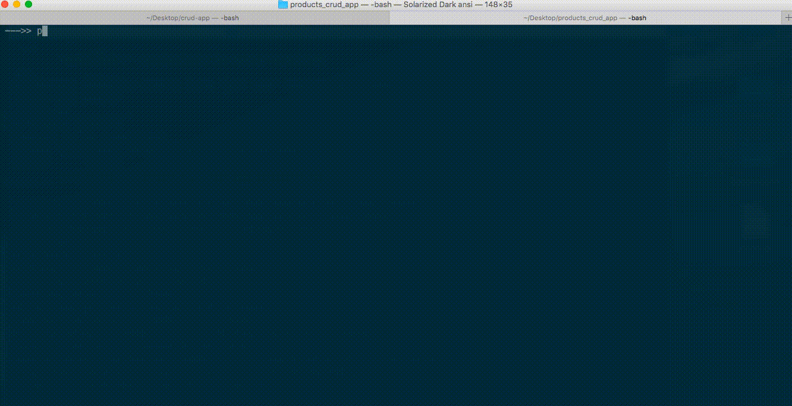
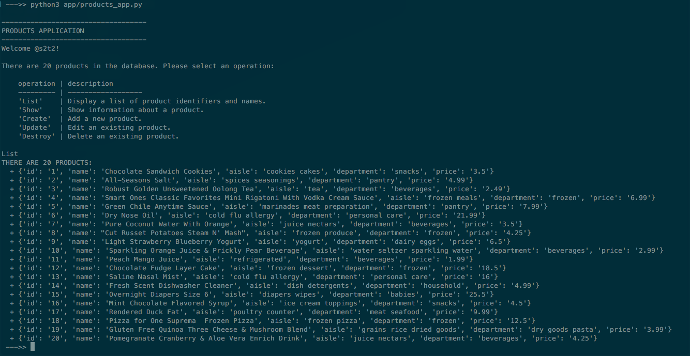
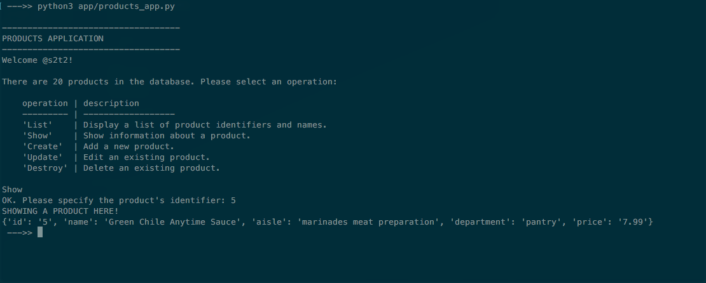
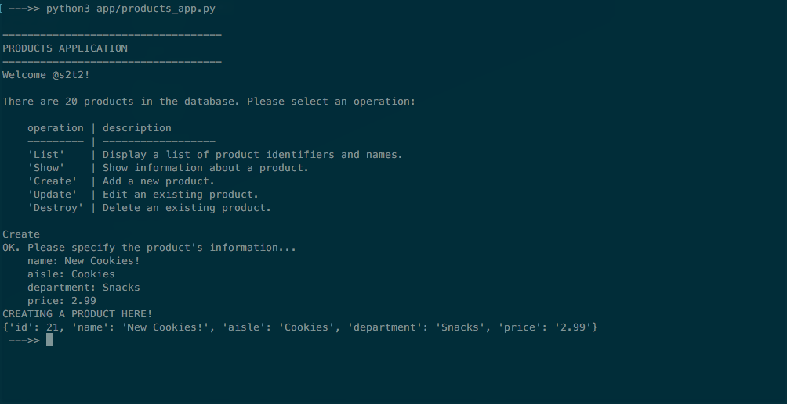
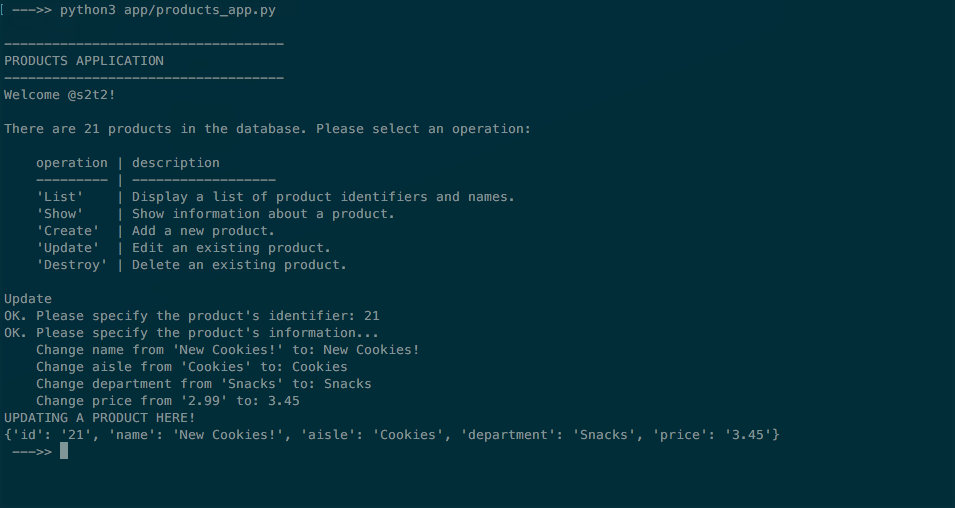
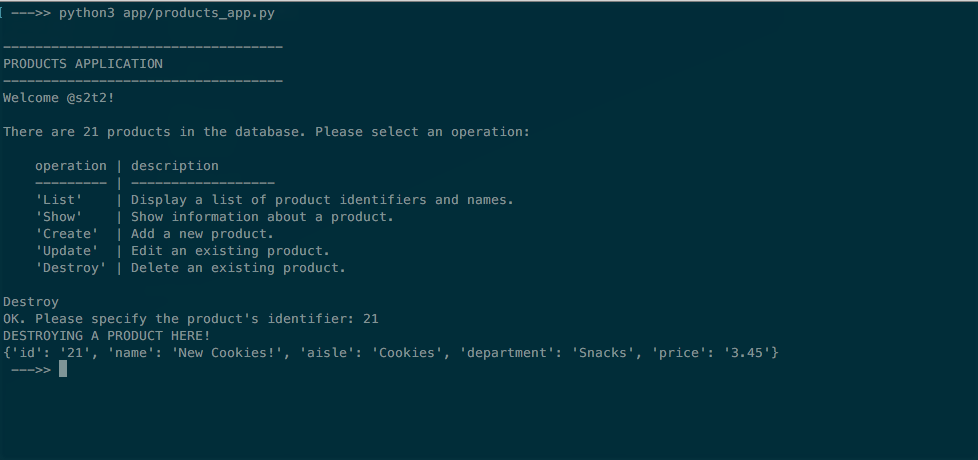

# Inventory Management App

Your local corner grocery store has hired you to help them modernize their checkout system.

After providing the store owner with an awesome checkout application, the store owner now asks you to create an application which will help store managers keep track of their inventory of products. The store owner would like to use the application at each of a small handful of store locations, each of which has its own product inventory.

Write a Python program to perform CRUD operations on an inventory of products kept in a CSV file.

> NOTE: CRUD is an acronym for "Create", "Read", "Update", and "Destroy". These operations represent the primary actions performed on database resources (i.e. records) within an information system. The "Read" operation comprises two operations: the "List" operation for reading all resources, as well as the "Show" operation for reading a single resource.



The non-moving version :smile: :

List



Show



Create



Update



Destroy



> NOTE: Don't be constrained by the images above. Feel free to create your own user interface and experiences.

## Requirements

Your program should be executed from the root directory of your project repository, specifying the program's file path, for example: `python app/products_app.py`. This is super important due to the relativity of data file paths. See setup instructions for more information.

Your program should meet the requirements set forth in the sections below.

If you need help or inspiration, see the [Checkpoints](checkpoints.md) document for a step-by-step guided walk-through.

If you are moving through this project with ease, consider addressing one or more of the [Further Exploration](further.md) challenges, but only after you have finished the core required functionality.

### Repository Requirements

The program's source code should be hosted on GitHub.com in its own repository which uses the following conventions:

  + Contains a `README.md` file which provides instructions for how to install (i.e. "clone") and use the program.
  + Contains a `products_app.py` file located inside a directory named `app` (i.e. `app/products_app.py`) which represents the Python program.
  + Contains an empty `data` directory.
  + Optional Extra Credit: Contains a commit history which reflects incremental development progress, perhaps corresponding with the checkpoint steps.

### Datastore Requirements

The program should interface with an inventory of products kept in a CSV file named `data/products.csv`, however this CSV file should not be tracked in version control or included in your GitHub repository.

The program should assume existence of the CSV file in the specified location. And it should assume the CSV file contains the proper header row:

    id,name,aisle,department,price

The program should function even if the CSV file contains no additional rows besides the header row. This would correspond to a situation where there are no products in the inventory.

The program should function regardless of the order of rows in the CSV file.

### Interface Requirements

The program should display a user interface which contains:

  + A friendly greeting message including a user name of choice.
  + The number of products currently in inventory.
  + A list of all available operations (e.g. "List", "Show", "Create", "Update", and "Destroy") and instructions for how to select one.

### CRUD Operation Requirements

The program should prompt the user to select one CRUD operation at a time (e.g. "List", "Show", "Create", "Update", or "Destroy"). If an unrecognized operation is selected, the program should fail gracefully by displaying an "Unrecognized Operation" message to the user. Otherwise it should perform the selected operation in accordance with the following expectations, prompting the user for additional inputs as necessary:

  + The **List** operation should print information (identifiers and names at least) about each product in the inventory.
  + The **Show** operation should prompt the user for a product identifier. If the product identifier matches the identifier of an existing product in the inventory, the program should print all available information about that product.
  + The **Create** operation should prompt the user to input a new product's `"name"`, `"department"`, `"aisle"` and `"price"`, and should automatically determine the new product's `"id"` by adding 1 to the greatest identifier currently in the inventory. Then the program should save the new product's information by adding a new row at the bottom of the CSV file.
  + The **Update** operation should prompt the user for a product identifier. If the product identifier matches the identifier of an existing product in the inventory, the program should prompt the user to input new values for that product's `"name"`, `"department"`, `"aisle"` and `"price"` attributes, and overwrite that product's corresponding row in the CSV file.
  + The **Destroy** operation should prompt the user for a product identifier. If the product identifier matches the identifier of an existing product in the inventory, the program should display a helpful message and remove that product's corresponding row from the CSV file.

The "Show", "Update", and "Destroy" operations should each fail gracefully (i.e. display a friendly "Product Not Found" message) if no product matches the specified identifier.

## Instructions

### Setup

Create a new project repository on GitHub.com and note its remote clone address. Clone it to your Desktop or some other location on your local machine. Navigate into the project repository via the command line.

Create in the project repository the following files:

  + `README.md`
  + `app/products_app.py`
  + `data/.gitignore`

In the `README.md` file, place some markdown syntax or normal text content to identify your application and instruct someone else how to download and run it:

    # Name of Your App

    [Some description or other info about what the app does.]

    ## Installation

    Download the source code:

    ```shell
    git clone remote_clone_address_of_your_repo_here
    cd some/path/to/repo/
    ```

    Finally, download the [example `products.csv` file](https://raw.githubusercontent.com/prof-rossetti/nyu-info-2335-70-201706/master/projects/crud-app/products.csv) and save it as `data/products.csv`.

    ## Usage

    ```shell
    python app/products_app.py
    ```

In the `app/products_app.py` file, place some placeholder print statement, like `print("HELLO")`. This is the file that will eventually contain our program's code.

The program will need to use a CSV file inventory of products, and that CSV file will change many times over the course of our using the program, so we don't want to track its contents in version control. We want to achieve program-data independence. So in the `data/.gitignore`, place the following code, which says "exclude from version control all files in this directory besides this one":

    *
    !.gitignore


Commit your changes to version control using a message like "Setup new project repo".

Finally, download [the `products.csv` file](products.csv) into your repository's `data` directory so its name is `data/products.csv`. You can achieve this by updating your local fork of the course repository and copying the file from there (recommended), or by copying the file's ["raw" contents](https://raw.githubusercontent.com/prof-rossetti/nyu-info-2335-70-201706/master/projects/crud-app/products.csv) from GitHub and pasting them into a new local file (easier, and acceptable due to the small size of our file). Your application will read and write to this file, so there is a chance it may get messed up during application development. So you are encouraged to also download a redundant copy, perhaps called `products_copy.csv` into the `data` directory, to have on-hand in case you ever need to re-paste its contents into the main `products.csv` file.

After downloading the CSV file(s), you should not see them tracked in version control. If you do, make sure to configure the `data/.gitignore` file as prescribed above. Alright, you are ready to start development!

## Submission Instructions

By this time, students should be able to replicate the submission instructions for previous exercises, also abbreviated below.

### Step 1 - Creating a new Project Repo

Use the GitHub.com online interface to create a new GitHub repository under your control
named something like "point-of-sale-app".
When you create a new repository, in order to easily use the GitHub.com online interface to manage files,
check the box to **Initialize this repository with a README**.
Once the repository is created, add a file to it called `shopping_cart.py`.
Paste your Python script into that file, then save and commit it.
At this time you should be able to view your instructions online at your project repository's URL.

### Step 2 - Forking the Course Repo

If you have not yet already forked the course repository, do so now.

Otherwise, if you have already forked the course repository
(i.e. if you have already submitted a previous exercise),
then you will need to update your existing fork instead.

### Step 3 - Submitting a Pull Request

Add a new record to the [submissions file](submissions.csv),
to include your GitHub username and the repository's URL (e.g. `https://github.com/YOUR_USERNAME/point-of-sale-app`).
After updating your own fork, you will need to submit a Pull Request
for your content to be accepted into the main course repository.

## Evaluation

Full credit for presence of a Python program which runs without error, satisfies all requirements, and exactly produces the desired functionality.

Else 87.5% credit for presence of a Python program which runs without error, satisfies most requirements, and/or produces most of the desired functionality.

Else 75% credit for presence of a Python program which runs without error, satisfies many requirements, and produces much of the desired functionality.

Else half credit for presence of a Python program which doesn't run or doesn't meet the requirements, or doesn't produce much of the desired functionality.

Else no credit.
